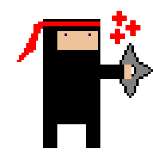
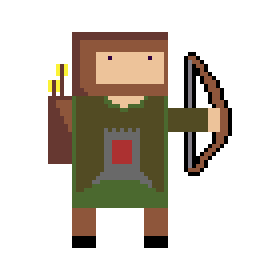
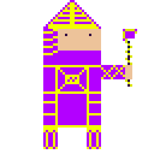
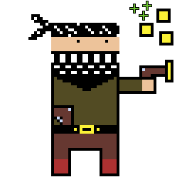
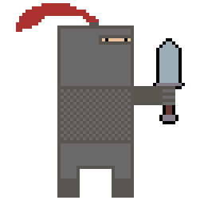
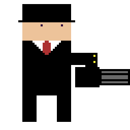
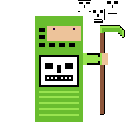
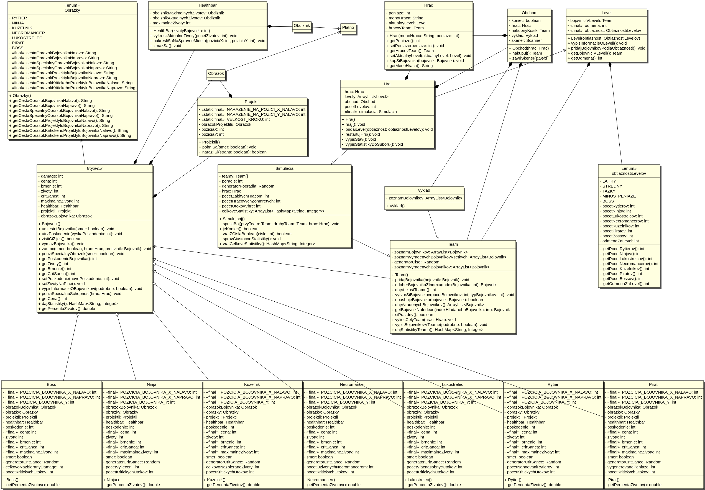

# Semestrálna práca z Informatiky 2 – Hra na báze bojovníkov

## Autor
**Matúš Uhlár**  
**Študijná skupina:** 5ZYI17  
**Cvičiaci:** doc. Ing. Jozef Kostolný PhD.  

---

## Popis projektu

Táto semestrálna práca je hrou vytvorenou v rámci predmetu Informatika 2. Hra je implementovaná s využitím objektovo-orientovaného programovania s cieľom zdokonaliť sa v porozumení konceptov polymorfizmu.

Hráč postupuje cez rôzne levely, bojuje s nepriateľmi a spravuje svoj tím bojovníkov. Počas hry je možné:
- Kupovať a vylepšovať bojovníkov.
- Získavať odmeny a manažovať zdroje.
- Poraziť nepriateľov a postupovať cez levely.
- Zobraziť štatistiky na konci hry.

---

## Obsah projektu

- **Užívateľská príručka:** Pravidlá hry, spustenie hry a opis mechaník.
- **Programátorská dokumentácia:** Návrh, UML diagramy, opis tried a balíčkov.
- **Kód projektu:** Triedy, enumerácie, a výnimky, ktoré tvoria celú hru.

---

## Požiadavky na systém

- **Java Development Kit (JDK) 17 alebo vyššie**
- **IntelliJ IDEA alebo iné Java IDE (voliteľné)**
- **Operačný systém:** Windows, macOS, Linux

---

## Inštalácia a spustenie

1. **Klonujte projekt:**
   - naklonujte si projekt z tohto repozitára 

2. **Spustenie hry:**
   - Spustite `Main.java`.

---

## Herné mechaniky

- **Spustenie hry:** Po zadaní mena sa hráč ocitne v menu s tromi možnosťami:
  1. Bojovať.
  2. Nakúpiť bojovníkov.
  3. Ukončiť hru.

- **Typy bojovníkov:** Hra obsahuje rôznych bojovníkov, ako rytier, ninja, lukostrelec, kúzelník, necromancer, pirát a boss. Každý má unikátne štatistiky a špeciálne schopnosti.

- **Ninja**
- 
- **Lukostrelec**
- 
- **Kúzelník**
- 
-  **Pirát**
-  
- **Rytier**
- 
- **Boss**
- 
- **Necromancer**
- 
---

## UML Diagram

---

## Struktúra kódu

### Balíčky

1. **bojovnici:** Obsahuje triedy reprezentujúce bojovníkov.
   - `Bojovnik`, `Rytier`, `Ninja`, `Pirát` atď.
2. **hra:** Obsahuje logiku hry a interakcie s hráčom.
   - `Hra`, `Hrac`, `Level`, `Simulacia` atď.
3. **prostredie:** Vizualizácia hry.
   - `Platno`, `Healthbar`, `Projektil` atď.
4. **obrazky:** Enum pre správu obrázkov.

---

## Štatistiky hry

Na konci hry sa vygeneruje súbor `statistiky.txt`, obsahujúci:
- Počet vyhraných/prehraných súbojov.
- Štatistiky jednotlivých bojovníkov.
- Čas hrania.

---

## Javadoc Dokumentácia

Kompletná Javadoc dokumentácia je dostupná v súbore `allclasses-index.html`. Otvorte tento súbor v prehliadači pre prehliadanie.

